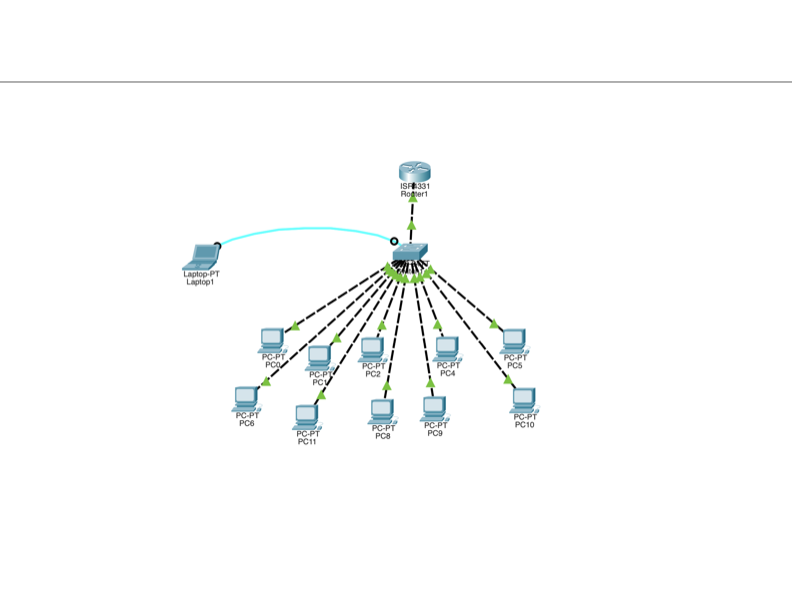

# Small Office LAN

## Contexto do projecto

Este projecto consiste na implementação de uma **rede local (LAN) para uma pequena empresa com 10 computadores**, utilizando o Cisco Packet Tracer.

O principal objectivo foi construir uma infraestrutura de rede funcional, permitindo que os computadores comunicassem entre si através de um switch e recebessem automaticamente as suas configurações de rede através de DHCP.

Do ponto de vista de administração de redes, o projecto foi desenvolvido para:

- Implementar uma rede LAN para 10 computadores.
- Configurar o endereçamento IPv4.
- Configurar um switch para interligar os dispositivos.
- Implementar DHCP para atribuição automática de endereços IP.
- Configurar o Default Gateway.
- Testar a conectividade entre os computadores.
- Realizar troubleshooting básico da rede.

## Tecnologias utilizadas

- Cisco Packet Tracer
- IPv4
- Ethernet
- Switching
- DHCP
- Default Gateway
- ICMP / Ping

# Resumo executivo

### Visão geral do projecto

O laboratório teve como objectivo construir uma pequena infraestrutura de rede para uma empresa com 10 computadores.

Foi utilizado um switch como equipamento central para interligar os computadores. O endereçamento dos dispositivos foi realizado utilizando IPv4 e o DHCP foi implementado para automatizar a atribuição dos endereços IP e outros parâmetros de rede.

Após a implementação, foram realizados testes de conectividade através do comando `ping`, permitindo verificar se os dispositivos conseguiam comunicar correctamente dentro da rede local.

### Principais conhecimentos adquiridos

1. **Endereçamento IPv4:**
   - Aprendi a configurar endereços IPv4 e máscaras de sub-rede.
   - Compreendi a relação entre endereço de rede, hosts e broadcast.
   - Aprendi a identificar se os dispositivos pertencem à mesma sub-rede.

2. **Switching:**
   - Aprendi a utilizar um switch Cisco para interligar vários dispositivos numa LAN.
   - Compreendi o papel do switch na comunicação entre os dispositivos da mesma rede.

3. **DHCP:**
   - Aprendi a utilizar DHCP para atribuir automaticamente endereços IP aos computadores.
   - Compreendi como a utilização de DHCP facilita a administração de uma rede com vários dispositivos.

4. **Default Gateway:**
   - Compreendi a função do Default Gateway.
   - Aprendi que o gateway é utilizado pelos dispositivos quando precisam de comunicar com redes diferentes da sua própria sub-rede.

5. **Troubleshooting:**
   - Aprendi a verificar as configurações de rede dos computadores.
   - Utilizei `ping` para testar a conectividade entre os dispositivos.
   - Desenvolvi uma abordagem básica para identificar problemas de comunicação na rede.

# Análise aprofundada

### Categoria 1: Implementação da LAN

A primeira etapa consistiu na criação da topologia da rede no Cisco Packet Tracer.

Os 10 computadores foram ligados a um switch, que funcionou como ponto central de comunicação entre os dispositivos.

A implementação permitiu compreender na prática como uma rede local é estruturada e como os switches permitem a comunicação entre diferentes dispositivos dentro da mesma rede.

  

### Categoria 2: Endereçamento IPv4

Foi definido um esquema de endereçamento IPv4 para os computadores da rede.

Durante esta etapa, foram trabalhados conceitos fundamentais de endereçamento IP, incluindo:

- Endereço IP;
- Máscara de sub-rede;
- Endereço de rede;
- Endereço de broadcast;
- Endereços de host;
- Default Gateway.

Esta configuração permitiu que os computadores fossem correctamente identificados dentro da rede e pudessem comunicar entre si.

### Categoria 3: Configuração do DHCP

Foi implementado DHCP para automatizar a configuração dos computadores.

Com o DHCP, os dispositivos puderam receber automaticamente os seus endereços IP e outros parâmetros necessários para a comunicação na rede.

Esta prática permitiu compreender a importância da automação na administração de redes e como o DHCP reduz a necessidade de configurar manualmente cada dispositivo.

### Categoria 4: Testes de conectividade

Após a configuração da rede, foram realizados testes de conectividade entre os computadores utilizando o comando:

`ping`

Os testes permitiram verificar:

- Se os computadores receberam correctamente os endereços IP;
- Se os dispositivos pertenciam à mesma rede;
- Se existia comunicação entre os hosts;
- Se as configurações de rede estavam correctas.

A realização destes testes permitiu desenvolver conhecimentos básicos de troubleshooting e validação de redes.

# Resultado final

A implementação resultou numa **LAN funcional composta por 10 computadores**, com endereçamento IPv4 e atribuição automática de configurações através de DHCP.

O projecto permitiu consolidar conhecimentos fundamentais de redes, especialmente em:

- IPv4;
- Switching;
- DHCP;
- Default Gateway;
- Conectividade;
- Troubleshooting.

Este laboratório serviu como base para projectos posteriores envolvendo conceitos mais avançados de redes, como **VLANs, STP, EtherChannel, OSPF, NAT e ACLs**.
